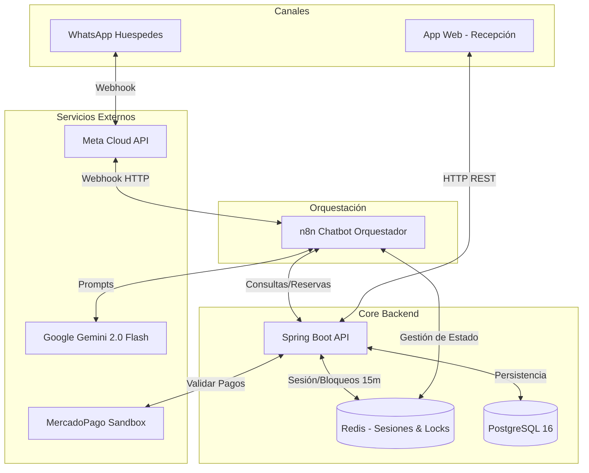

# SatoriPMS

Property Management System (PMS) diseñado para centralizar y automatizar la operación diaria del hotel Torre Satori mediante un canal conversacional (WhatsApp) y una aplicación web.

## 🏗️ Arquitectura del Sistema



## 📁 Estructura del Proyecto

* `apps/api/`: Backend monolítico en Java 21 (Spring Boot).
* `apps/web/`: Frontend administrativo en React + Vite.
* `flows/n8n/`: Versiones de los flujos del chatbot exportados en JSON.
* `docs/`: Documentación del proyecto (Módulos, Estado actual, Cambios).
* `docker-compose.yml`: Orquestación de infraestructura.

## 🚀 Infraestructura y Puertos

El proyecto utiliza Docker Compose para levantar la infraestructura local.

| Servicio | Puerto | Descripción |
|----------|--------|-------------|
| **API** | `8080` | Backend Spring Boot. Expone los endpoints REST. |
| **Frontend** | `5173` | Panel de administración (App Web). |
| **n8n** | `5678` | Plataforma de flujos para el chatbot. |
| **PostgreSQL**| `5432` | Base de datos relacional (expuesto solo localmente). |
| **Redis** | `6379` | Caché y manejo de estados/bloqueos temporales. |

El servicio n8n es opcional. En `.env`, `COMPOSE_PROFILES=n8n` lo activa y
`N8N_PUBLIC_URL` define su URL pública (webhooks y editor). Para reemplazar el
dominio, cambia esa URL. Para no levantar n8n, deja `COMPOSE_PROFILES` vacío y
arranca con `docker compose up -d --remove-orphans`; el volumen `n8n_data` se
conserva. Si también quieres borrar los datos de n8n, elimina únicamente el
volumen `n8n_data` del proyecto; evita `docker compose down -v`, porque también
borraría los volúmenes de PostgreSQL y Redis.

Para levantar el proyecto:
```bash
docker compose up -d --remove-orphans
```
